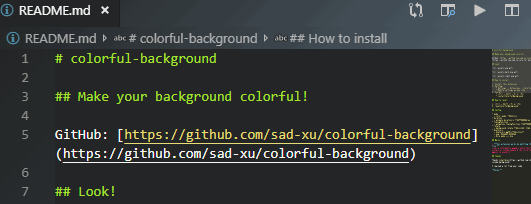
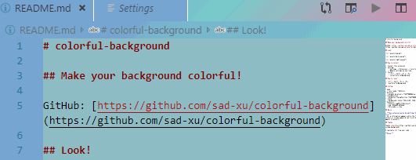

# colorful-background

## Make your background colorful!

GitHub: [https://github.com/sad-xu/colorful-background](https://github.com/sad-xu/colorful-background)

## Look!

## How to install

1. Install this extension
2. Setting
    * Settings -> Extensions -> Colorful Background
    * Modify settings as you like
3. Install
    * (Ctrl + Shift + P) or (F1)
    * installColorfulBackground

## How to reset

1. (Ctrl + Shift + P) or (F1)
2. resetColorfulBackground
 
## Config

* mode
  + color mode 预设配色方案
* duration
  + animate duration/s 背景变化速度/秒
* timingFunction
  + animation timingFunction 背景变化速度曲线
* rotate
  + background rotate 背景颜色分布角度
* diyColors
  + diyColors 自定义背景颜色列表
  + exp: #23a6d5,#23d5ab
  + Only mode === diy

## Warns

> **This extension works by editting the vscode's css file.**  
> So, a information appears while the first time to install or vscode update.U can click the [never show again] to avoid it.

## Thanks

Thanks [shalldie](https://github.com/shalldie/vscode-background)

I learned a lot from your code

**Enjoy!**
